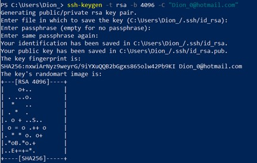
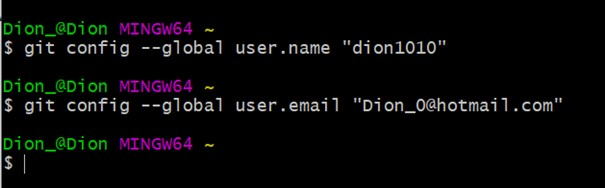
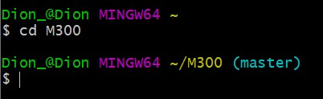
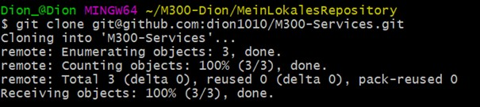
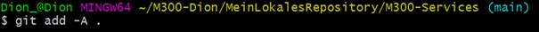
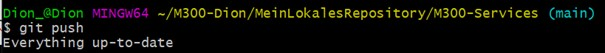
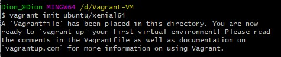
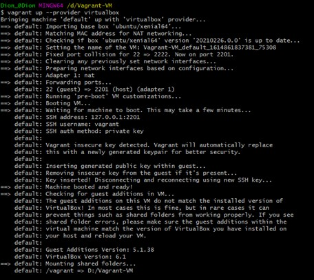
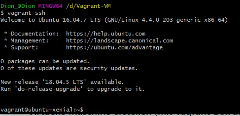

# 10_Toolumgebung

##  Git-Hub Account

**Git-Hub Account erstellen unter:**

[https://github.com/](https://github.com/)

**Neues Projekt starten im Dashboard:**

**SSH-Key erstellen**

**SSH-Key dem SSH-Agent hinzufügen**

Unter dem Feld «Key» muss man den davor kopierten Inhalt der PUB Dateien kopieren.

So sollte es am Ende aussehen.

 ##  Git-Client

 [**Nach oben**](#inhaltsverzeichnis)

**Installer herunterladen:**

[https://git-scm.com/downloads](https://git-scm.com/downloads)

Während der Installation sollte man beim Wizzard alles beim Standard belassen.

**Git-Client konfigurieren:**

##  Repository
[**Nach oben**](#inhaltsverzeichnis)

**Repository clonen:**

Zuerst muss man die Bash öffnen.

Anschlissend mit folgendem Befehl das Repository clonen:

In das neue M300-Verzeichnis wechseln, welches man davor erstellt hat:

Nun Repository aktualisieren und anzeigen:

**Repository herunterladen &amp; aktualisieren (clone/pull):**

**Clone:**

**Aktualisieren:**

**Repository hochladen:**

Dateien dem Upload hinzufügen:

**Upload commiten:**

**Und zu guter Letzt Upload pushen:**

## Vagrant

[**Nach oben**](#inhaltsverzeichnis)

**Vargant installieren unter:**

[https://www.vagrantup.com/](https://www.vagrantup.com/)

**Vagrant File erstellen:**

**Vagrant virtuelle Maschine erstellen:**

**Verzeichnis der VM wechseln und folgenden Befehl für eine SSH Verbindung mit der VM eingeben:**

