# M300-Services

## Einleitung

Dies ist eine Dokumentation der LB01 im Modul 300. In dieser Dokumentation werden verschiedene Arbeitsschritte Dokumentiert, welche wichtig sind und auch hilfreich für andere User. In dieses Modul bin ich komplett ohne Vorwisse eingestiegen und hatte davor nichts damit zu tun.

## Inhaltsverzeichnis

* 01 - [GitHub Account](#git-hub-account)
* 02 - [Git-Client](#git-client)
* 03 - [Repository](#repository)
* 04 - [Vagrant](#vagrant)

## Git-Hub Account

**Git-Hub Account erstellen unter:**

[https://github.com/](https://github.com/)

**Neues Projekt starten im Dashboard:**

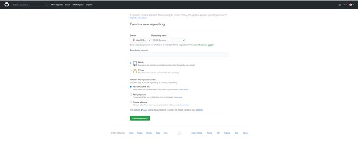

**SSH-Key erstellen**

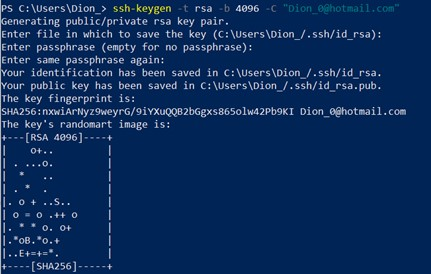

**SSH-Key dem SSH-Agent hinzufügen**

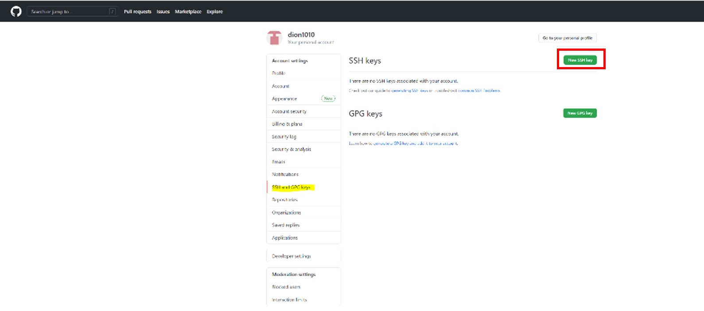

Unter dem Feld «Key» muss man den davor kopierten Inhalt der PUB Dateien kopieren.

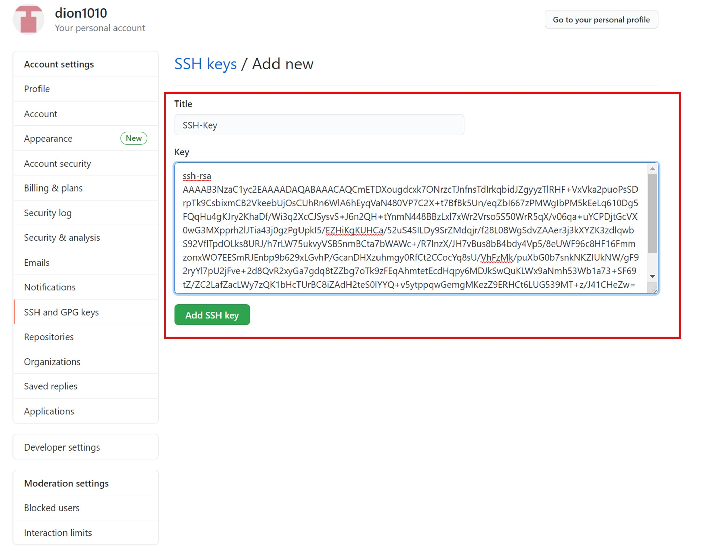

So sollte es am Ende aussehen.

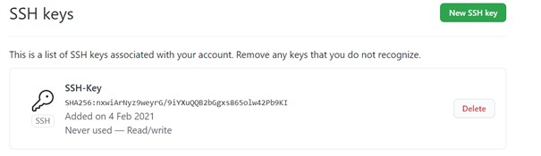

 ##  Git-Client

 [**Nach oben**](#inhaltsverzeichnis)

**Installer herunterladen:**

[https://git-scm.com/downloads](https://git-scm.com/downloads)

Während der Installation sollte man beim Wizzard alles beim Standard belassen.

**Git-Client konfigurieren:**

## Repository
[**Nach oben**](#inhaltsverzeichnis)

**Repository clonen:**

Zuerst muss man die Bash öffnen.

Anschlissend mit folgendem Befehl das Repository clonen:

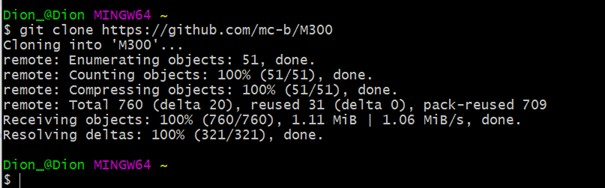

In das neue M300-Verzeichnis wechseln, welches man davor erstellt hat:

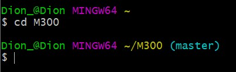

Nun Repository aktualisieren und anzeigen:

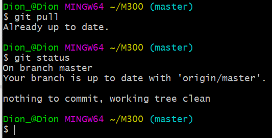

**Repository herunterladen &amp; aktualisieren (clone/pull):**

**Clone:**

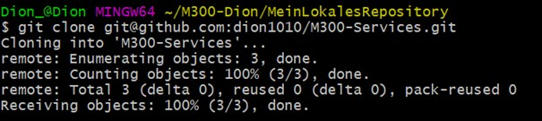

**Aktualisieren:**

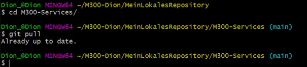

**Repository hochladen:**

Dateien dem Upload hinzufügen:

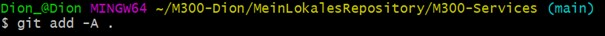

**Upload commiten:**

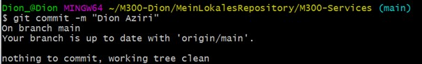

**Und zu guter Letzt Upload pushen:**

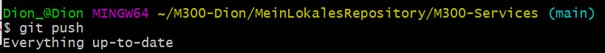

## Vagrant

[**Nach oben**](#inhaltsverzeichnis)

**Vargant installieren unter:**

[https://www.vagrantup.com/](https://www.vagrantup.com/)

**Vagrant File erstellen:**

**Vagrant virtuelle Maschine erstellen:**

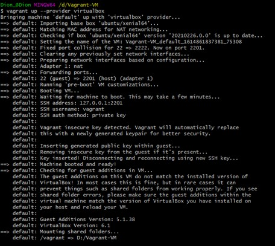

**Verzeichnis der VM wechseln und folgenden Befehl für eine SSH Verbindung mit der VM eingeben:**

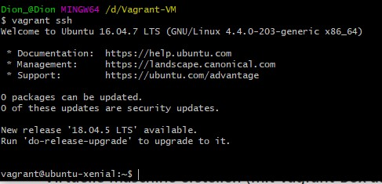

**Vagrant VM von Cloud downloaden**

Zuerst sollte man überhaupt nach einer bestimmten Box suchen die man downloaden möchte:

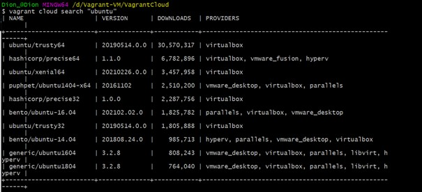

Nachdem man dann gefunden hat was man möchte und auch nachgeschaut hat, ob es kompatibel ist mit der Virtualisierungslösung die man verwendet, kann man weiter gehen zum download:

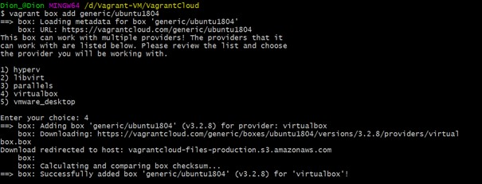

Sobald der download vollendet ist kann man das ganze mit dem Befehl:

 **vagrant up "Name der Box"**

