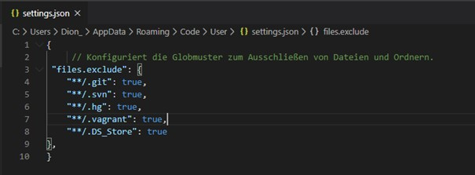

# M300-Services

## Virtuellen Host installieren

Virtual Box:

[https://www.virtualbox.org/](https://www.virtualbox.org/)

VMWare Workstation Pro/Player:

[https://my.vmware.com/de/web/vmware/downloads/info/slug/desktop\_end\_user\_computing/vmware\_workstation\_player/16\_0](https://my.vmware.com/de/web/vmware/downloads/info/slug/desktop_end_user_computing/vmware_workstation_player/16_0)

Oder man kann auch als alternative HyperV benutzen.

## Visual Studio Code installieren

[https://code.visualstudio.com/download](https://code.visualstudio.com/download)

**settings.json editieren:**

**Git-Hub Account erstellen unter:**

[https://github.com/](https://github.com/)

**Neues Projekt starten im Dashboard:**

**SSH-Key erstellen**

**SSH-Key dem SSH-Agent hinzufügen**

 Inhalt der zuvor erstellten id\_rsa.pub Datei in die Zwischenablage kopieren.

Unter dem Feld «Key» muss man den davor kopierten Inhalt der PUB Dateien kopieren.

So sollte es am Ende aussehen.

## Git-Client

**Installer herunterladen:**

[https://git-scm.com/downloads](https://git-scm.com/downloads)

Während der Installation sollte man beim Wizzard alles beim Standard belassen.

**Git-Client konfigurieren:**

**Repository clonen:**

Zuerst muss man die Bash öffnen.

Anschlissend mit folgendem Befehl das Repository clonen:

In das neue M300-Verzeichnis wechseln:

Nun Repository aktualisieren und anzeigen:

## Repository herunterladen &amp; aktualisieren (clone/pull):

**Clone:**

**Aktualisieren:**

**Repository hochladen:**

Dateien dem Upload hinzufügen:

**Upload commiten:**

**Und zu guter Letzt Upload pushen:**

## Vargant

**Vargant installieren unter:**

[https://www.vagrantup.com/](https://www.vagrantup.com/)

**Vagrant File erstellen:**

**Vagrant virtuelle Maschine erstellen:**

**Verzeichnis der VM wechseln und folgenden Befehl für eine SSH Verbindung mit der VM eingeben:**

